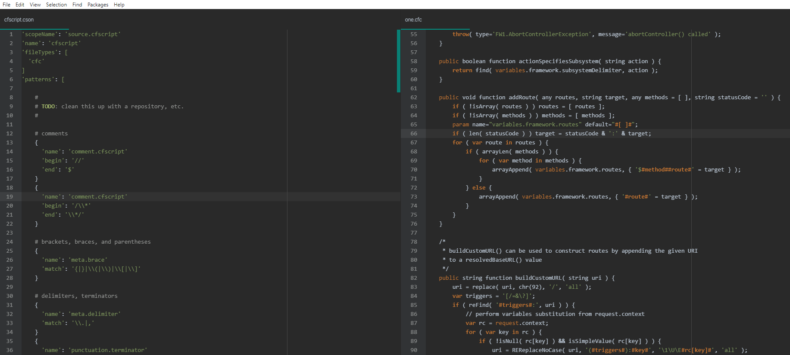
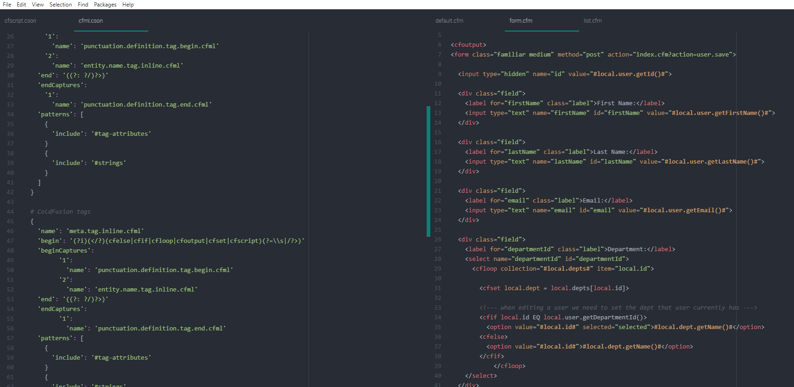

# language-coldfusion-simple package

A simple/barebones ColdFusion grammar for the Atom editor.

## Goals

* clear visual distinction for syntax highlighting
* fast
* semantically correct, to support other features of the grammar

## TODO

* clean up

## Reference Projects

* **Creating a Legacy TextMate Grammar** - including sample JavaScript and HTML grammars
  * https://flight-manual.atom.io/hacking-atom/sections/creating-a-legacy-textmate-grammar/

* **Language Grammars - TextMate 1.x Manual**
  * https://macromates.com/manual/en/language_grammars

* **CFML Grammar for Atom**
  * https://github.com/atuttle/atom-language-cfml

## Screenshot

### cfscript Grammar

### cfml Grammar

